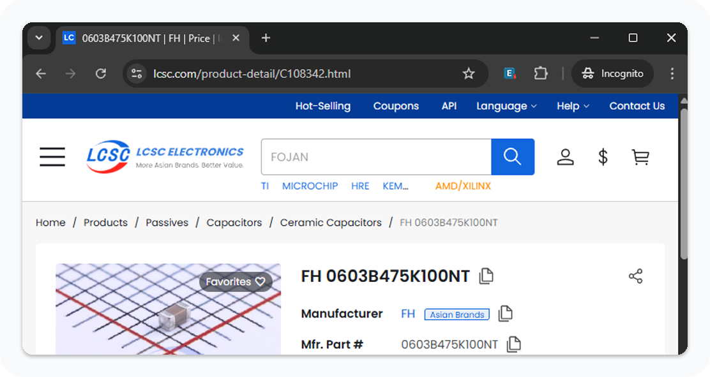
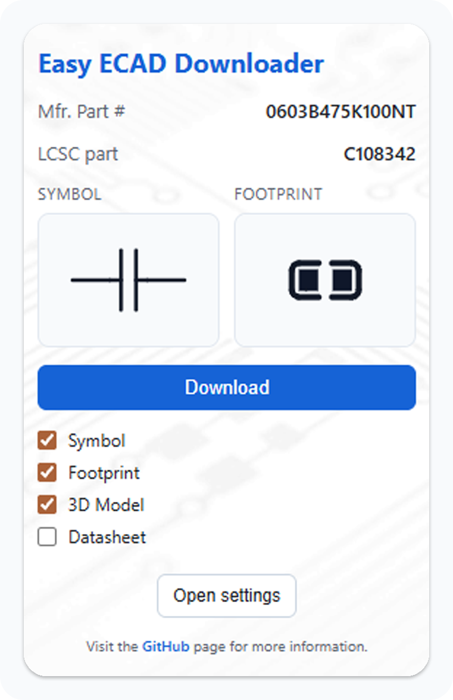
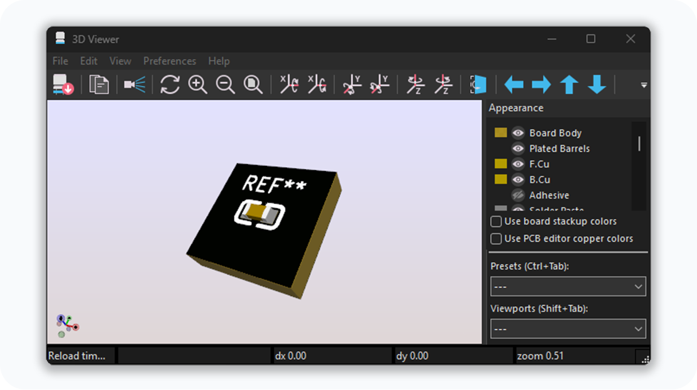
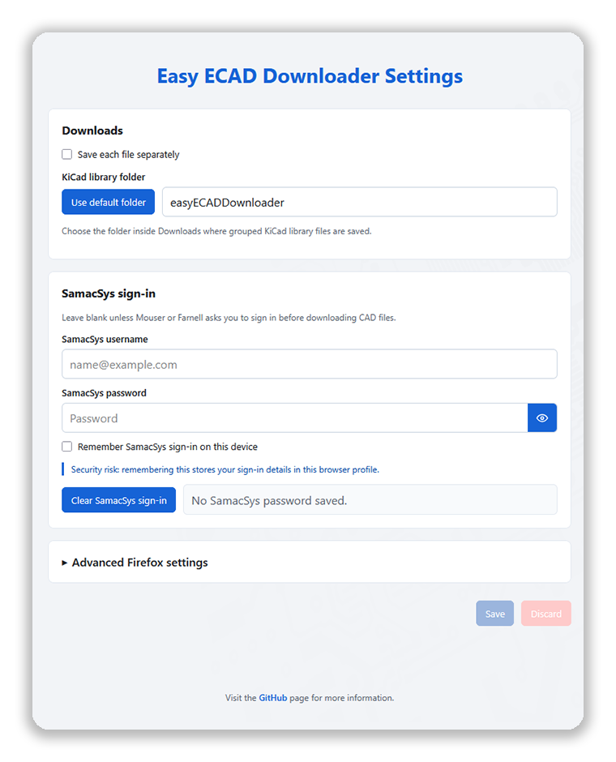
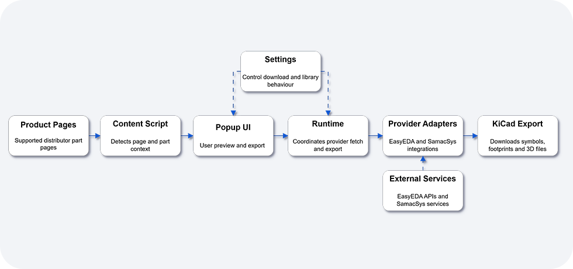

<p align="center">
  
</p>

<p align="center">
  <a href="https://github.com/JoeShade/Easy-ECAD-Downloader/stargazers"></a>
  <a href="https://github.com/JoeShade/Easy-ECAD-Downloader/forks"></a>
  <a href="LICENSE"></a>
  <a href="https://chromewebstore.google.com/detail/easyeda-downloader/egbkokdcahpjimldjjaobimnofbdnncb"></a>
  <a href="https://addons.mozilla.org/en-GB/firefox/addon/easy-ecad-downloader/"></a>
</p>

<p align="center">
  <a href="https://chromewebstore.google.com/detail/easyeda-downloader/egbkokdcahpjimldjjaobimnofbdnncb"><strong>Install for Chrome</strong></a>
  &nbsp;|&nbsp;
  <a href="https://addons.mozilla.org/en-GB/firefox/addon/easy-ecad-downloader/"><strong>Install for Firefox</strong></a>
  &nbsp;|&nbsp;
  <a href="#quick-start"><strong>Quick start</strong></a>
  &nbsp;|&nbsp;
  <a href="#faq"><strong>FAQ</strong></a>
</p>

Easy ECAD Downloader is a browser extension for exporting KiCad-compatible CAD assets from supported distributor product pages.

It works on supported JLCPCB, LCSC, Mouser, Farnell, element14, and Newark part pages, and can download the available KiCad files for you: symbols, footprints, 3D models, and datasheets.

<br>

<p>
  
  <strong>Important:</strong> Generated library files should always be reviewed before manufacturing. Verify pin mapping, footprint dimensions, 3D model alignment, and datasheet accuracy before using exported files in production designs.
</p>
<br clear="left">

##  Contents

- [Installation](#installation)
- [Quick start](#quick-start)
- [Usage walkthrough](#usage-walkthrough)
- [Output structure](#output-structure)
- [Supported sources and outputs](#supported-sources-and-outputs)
- [Settings](#settings)
- [FAQ](#faq)
- [Technical overview](#technical-overview)
- [Contributing](#contributing)
- [Supporting docs](#supporting-docs)
- [License and attribution](#license-and-attribution)

##  Installation

| Browser | Install from | Notes |
|---|---|---|
| Chrome, Edge, Brave, and other Chromium browsers | [Chrome Web Store](https://chromewebstore.google.com/detail/easyeda-downloader/egbkokdcahpjimldjjaobimnofbdnncb) | Full support for EasyEDA-backed pages and SamacSys-backed Mouser/Farnell/element14/Newark downloads. |
| Firefox | [Firefox Add-ons](https://addons.mozilla.org/en-GB/firefox/addon/easy-ecad-downloader/) | Works for EasyEDA-backed pages. SamacSys-backed Mouser/Farnell/element14/Newark downloads need the optional Firefox relay setup. |

##  Quick start

1. Open a supported JLCPCB, LCSC, Mouser, Farnell, element14, or Newark component page.
2. Click the Easy ECAD Downloader extension icon.
3. Review the detected manufacturer and source part details.
4. Choose which assets to export.
5. Click `Download`.
6. Open the generated files from KiCad and review them before use.

##  Usage walkthrough

### 1. Open a supported component page

The content script detects supported part contexts from EasyEDA-backed JLCPCB/LCSC pages or SamacSys-backed Mouser/Farnell/element14/Newark pages.

<p align="center">
  
</p>

### 2. Preview and download from the popup

The popup shows manufacturer details, source-specific part metadata, symbol and footprint previews, and the available export options.

<p align="center">
  
</p>

### 3. Use the generated KiCad files

Library mode creates a KiCad-style symbol library, footprint library, model folder, and datasheet folder under your browser downloads directory.

<p align="center">
  
</p>

##  Output structure

When `Save each file separately` is disabled, files are grouped under `Downloads/<library root>/`. The default library root is `easyECADDownloader`.

```text
Downloads/
`-- easyECADDownloader/
    |-- easyECADDownloader.kicad_sym
    |-- easyECADDownloader.pretty/
    |   `-- <component>.kicad_mod
    |-- easyECADDownloader.3dshapes/
    |   |-- <component>.step
    |   `-- <component>.wrl
    `-- datasheets/
        `-- <component>.pdf
```

When `Save each file separately` is enabled, selected files are saved as loose downloads instead of being grouped into a shared KiCad library folder. Exact filenames can vary by source.

```text
Downloads/
|-- <component>.kicad_sym
|-- <component>.kicad_mod
|-- <component>.step
|-- <component>.wrl
`-- <component>-datasheet.pdf
```

When a footprint and matching 3D model are exported together, the footprint model reference is rewritten to the generated model path. If no 3D model is exported, stale model references are removed from the generated footprint.

##  Supported sources and outputs

| Source flow | Pages | Symbol | Footprint | 3D model | Datasheet | Notes |
|---|---|---:|---:|---:|---:|---|
| EasyEDA-backed | JLCPCB, LCSC | Yes | Yes | When available | When available | Uses the detected LCSC id and upstream EasyEDA payload. |
| SamacSys-backed | Mouser, Farnell, element14, Newark | Yes | Yes | When available | No | Downloads the upstream KiCad ZIP and repackages selected assets. |

##  Settings

<p align="center">
  
</p>

| Setting | Purpose |
|---|---|
| `Save each file separately` | Switches between loose downloads and grouped KiCad library output. |
| `KiCad library folder` | Sets the Downloads-relative folder used for library mode, such as `easyECADDownloader` or `KiCad/easyECAD`. |
| `SamacSys username` and `SamacSys password` | Optional upstream sign-in details for Mouser/Farnell/element14/Newark CAD ZIP downloads. |
| `Advanced Firefox settings` | Configures the user-managed Firefox relay URL and helper-service auth when SamacSys export is needed in Firefox. |

Password and token fields are blank when the settings page opens, and each field has a local show/hide button for checking typed values. New values are kept for the current browser session by default. Tick the relevant `Remember ... on this device` box only if you accept the risk of storing that secret in the browser profile.

##  FAQ

<details>
<summary><strong>View frequently asked questions</strong></summary>

<br>

<details>
<summary><strong>What does Easy ECAD Downloader do?</strong></summary>

<br>

Easy ECAD Downloader is a browser extension for downloading KiCad-compatible ECAD assets from supported distributor pages. It helps export available symbols, footprints, 3D models, and datasheets from JLCPCB, LCSC, Mouser, Farnell, element14, and Newark product pages.

</details>

<details>
<summary><strong>Which websites does Easy ECAD Downloader support?</strong></summary>

<br>

Easy ECAD Downloader supports JLCPCB, LCSC, Mouser, Farnell, element14, and Newark product pages. JLCPCB and LCSC use EasyEDA-backed component data, while Mouser, Farnell, element14, and Newark use SamacSys-backed CAD downloads.

</details>

<details>
<summary><strong>What KiCad files can Easy ECAD Downloader create?</strong></summary>

<br>

Depending on the part and source data, Easy ECAD Downloader can create KiCad symbol libraries, footprint files, 3D model files, and datasheet PDFs. Common output files include `.kicad_sym`, `.kicad_mod`, `.pretty`, `.step`, `.wrl`, and PDF datasheets.

</details>

<details>
<summary><strong>Where are the downloaded KiCad files saved?</strong></summary>

<br>

In library mode, Easy ECAD Downloader saves files into a KiCad-style library folder under your browser Downloads directory. By default, this is `Downloads/easyECADDownloader/`. The output is grouped into a symbol library, a `.pretty` footprint folder, a 3D models folder, and a datasheets folder when applicable. If `Save each file separately` is enabled, selected files are saved directly into the browser downloads folder.

</details>

<details>
<summary><strong>Do I still need to check the downloaded symbol or footprint?</strong></summary>

<br>

Yes. Generated CAD assets should always be reviewed before manufacturing. Check pin mapping, pad numbering, footprint dimensions, polarity, orientation, courtyard and clearance assumptions, 3D model placement, and datasheet accuracy before ordering boards.

</details>

<details>
<summary><strong>How do I import JLCPCB or EasyEDA footprints and symbols into KiCad easily?</strong></summary>

<br>

Open a supported JLCPCB or LCSC component page, click the Easy ECAD Downloader extension icon, preview the available assets, and download the KiCad output. The extension converts the available EasyEDA-backed component data into KiCad-compatible symbol, footprint, and 3D model files where those assets exist.

</details>

<details>
<summary><strong>Can I download EasyEDA footprints for KiCad?</strong></summary>

<br>

Yes. For supported JLCPCB and LCSC pages, Easy ECAD Downloader downloads EasyEDA-backed component data and exports KiCad-compatible footprint files. When available, it can also export the matching symbol, 3D model, and datasheet.

</details>

<details>
<summary><strong>How do I download JLCPCB footprints for KiCad?</strong></summary>

<br>

Find the supported JLCPCB or LCSC component page, open Easy ECAD Downloader, and download the available KiCad footprint. This avoids manually redrawing the land pattern when source CAD data is already available.

</details>

<details>
<summary><strong>Can I convert an LCSC part number into a KiCad symbol, footprint, and 3D model?</strong></summary>

<br>

Yes, for supported LCSC or JLCPCB parts with available EasyEDA-backed data. Easy ECAD Downloader detects the part from the browser page and exports the available KiCad assets without requiring a command-line workflow.

</details>

<details>
<summary><strong>Is Easy ECAD Downloader an EasyEDA to KiCad converter?</strong></summary>

<br>

Yes, for component-level library assets. Easy ECAD Downloader converts supported EasyEDA-backed component data into KiCad-compatible symbols, footprints, and 3D models. It is not a full EasyEDA project, schematic, or PCB-layout migration tool.

</details>

<details>
<summary><strong>Can I download KiCad footprints from Mouser?</strong></summary>

<br>

Yes, when the Mouser product page provides supported ECAD data. Easy ECAD Downloader uses the Mouser and SamacSys CAD flow to download the available KiCad files and organize the selected symbol, footprint, and 3D model assets.

</details>

<details>
<summary><strong>Can I download KiCad footprints from Farnell, element14, or Newark?</strong></summary>

<br>

Yes, when the Farnell, element14, or Newark product page links to supported SamacSys ECAD data. Easy ECAD Downloader can export the available KiCad symbol, footprint, and 3D model files from the supported download flow.

</details>

<details>
<summary><strong>Is Easy ECAD Downloader a Library Loader alternative for KiCad?</strong></summary>

<br>

For supported JLCPCB, LCSC, Mouser, Farnell, element14, and Newark pages, yes. Easy ECAD Downloader can reduce the need for a separate Library Loader workflow by detecting the part page, downloading the available CAD assets, and organizing KiCad-compatible output. Library Loader may still be useful for unsupported distributors, unsupported parts, or non-KiCad workflows.

</details>

<details>
<summary><strong>How do I add downloaded symbols and footprints to KiCad?</strong></summary>

<br>

Add the generated `.kicad_sym` file through KiCad's symbol library manager and add the generated `.pretty` folder through KiCad's footprint library manager. KiCad tracks symbol and footprint libraries separately, so add both if you downloaded both asset types.

</details>

<details>
<summary><strong>Why is a KiCad symbol, footprint, 3D model, or datasheet missing?</strong></summary>

<br>

Easy ECAD Downloader can only export files that are available from the source page or linked component metadata. Some components have a footprint but no symbol, no 3D model, no datasheet, or incomplete upstream CAD data.

</details>

</details>

##  Technical overview

<p align="center">
  
</p>

At a high level, the content script detects supported part pages, the popup requests previews and downloads, the service-worker runtime routes provider-specific work, and the source adapters fetch or repackage upstream CAD assets for KiCad.

Key implementation areas:

- `src/content_script.js`: DOM inspection and provider-aware part detection.
- `src/popup.js`: popup UI, settings, preview requests, and export requests.
- `src/service_worker_runtime.js`: provider routing and worker orchestration.
- `src/core/`: shared settings, downloads, preview data, and storage-backed library helpers.
- `src/sources/`: EasyEDA and SamacSys source adapters.
- `src/kicad/`: EasyEDA parsing, KiCad emitters, shared conversion helpers, and OBJ-to-WRL conversion.
- `tests/`: regression suite for behavior, conversion, browser runtime boundaries, and repository hygiene.

##  Contributing

Read [contributing.md](contributing.md) for development setup, local validation, contribution expectations, and manual extension-loading instructions. Read [AGENTS.md](AGENTS.md) for repository working rules.

Good contributions include parser fixes for real component pages, regression tests for failed exports, output-format corrections, browser compatibility fixes, and documentation that makes the workflow clearer for KiCad users.

##  Supporting docs

- [systemDesign.md](systemDesign.md): design source of truth.
- [CHANGELOG.md](CHANGELOG.md): notable changes by release or branch delta.
- [SECURITY.md](SECURITY.md): vulnerability reporting and credential-handling notes.
- [docs/architecture-notes.md](docs/architecture-notes.md): short implementation notes.
- [docs/firefox-samacsys-proxy.md](docs/firefox-samacsys-proxy.md): Cloudflare Worker relay example for Firefox SamacSys support.

##  License and attribution

This project includes and is derived from:

`easyeda2kicad.py`  
Copyright (c) uPesy  
Licensed under the GNU Affero General Public License v3.0

Additional code in this repository remains under the repository license.

See [LICENSE](LICENSE) for details.

<p align="center" style="font-size: 18px;">
  Made with  for open-source electronics.
</p>
