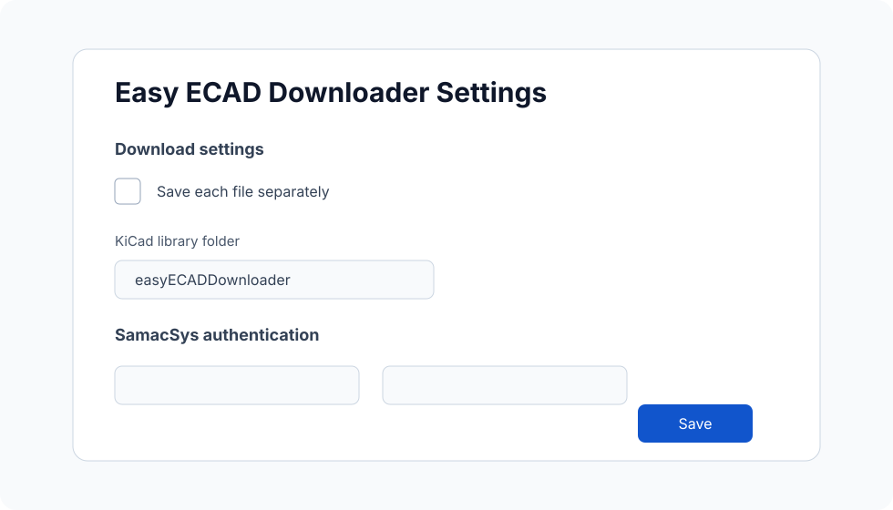
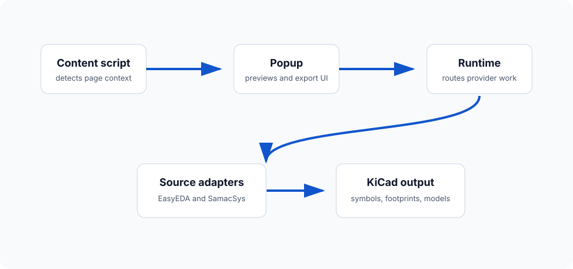

<p align="center">
  
</p>

<p align="center">
  <a href="https://github.com/JoeShade/easyEdaDownloader/stargazers"></a>
  <a href="https://github.com/JoeShade/easyEdaDownloader/forks"></a>
  <a href="LICENSE"></a>
  <a href="https://chromewebstore.google.com/detail/easyeda-downloader/egbkokdcahpjimldjjaobimnofbdnncb"></a>
  <a href="https://addons.mozilla.org/en-GB/firefox/addon/easyeda-downloader/"></a>
</p>

<p align="center">
  <a href="https://chromewebstore.google.com/detail/easyeda-downloader/egbkokdcahpjimldjjaobimnofbdnncb"><strong>Install for Chrome</strong></a>
  &nbsp;|&nbsp;
  <a href="https://addons.mozilla.org/en-GB/firefox/addon/easyeda-downloader/"><strong>Install for Firefox</strong></a>
  &nbsp;|&nbsp;
  <a href="#quick-start"><strong>Quick start</strong></a>
  &nbsp;|&nbsp;
  <a href="#faq"><strong>FAQ</strong></a>
</p>

<p align="center">
  <video src="docs/assets/readme/demo-placeholder.mov" controls width="820" title="Easy ECAD Downloader demo placeholder"></video>
</p>

Easy ECAD Downloader is a browser extension for exporting KiCad-compatible CAD assets from supported distributor product pages.

It works on supported JLCPCB, LCSC, Mouser, and Farnell part pages, and can download the available KiCad files for you: symbols, footprints, 3D models, and datasheets.

<p>
  
  <strong>Important:</strong> Generated library files should always be reviewed before manufacturing. Verify pin mapping, footprint dimensions, 3D model alignment, and datasheet accuracy before using exported files in production designs.
</p>
<br clear="left">

##  Contents

- [Installation](#installation)
- [Quick start](#quick-start)
- [Usage walkthrough](#usage-walkthrough)
- [Output structure](#output-structure)
- [Supported sources and outputs](#supported-sources-and-outputs)
- [Settings](#settings)
- [FAQ](#faq)
- [Technical overview](#technical-overview)
- [Contributing](#contributing)
- [Supporting docs](#supporting-docs)
- [License and attribution](#license-and-attribution)

##  Installation

| Browser | Install from | Notes |
|---|---|---|
| Chrome, Edge, Brave, and other Chromium browsers | [Chrome Web Store](https://chromewebstore.google.com/detail/easyeda-downloader/egbkokdcahpjimldjjaobimnofbdnncb) | Full support for EasyEDA-backed pages and SamacSys-backed Mouser/Farnell downloads. |
| Firefox | [Firefox Add-ons](https://addons.mozilla.org/en-GB/firefox/addon/easyeda-downloader/) | Works for EasyEDA-backed pages. SamacSys-backed Mouser/Farnell downloads need the optional Firefox relay setup. |

##  Quick start

1. Open a supported JLCPCB, LCSC, Mouser, or Farnell component page.
2. Click the Easy ECAD Downloader extension icon.
3. Review the detected manufacturer and source part details.
4. Choose which assets to export.
5. Click `Download`.
6. Open the generated files from KiCad and review them before use.

##  Usage walkthrough

### 1. Open a supported component page

The content script detects supported part contexts from EasyEDA-backed JLCPCB/LCSC pages or SamacSys-backed Mouser/Farnell pages.

<p align="center">
  
</p>

### 2. Preview and download from the popup

The popup shows manufacturer details, source-specific part metadata, symbol and footprint previews, and the available export options.

<p align="center">
  
</p>

### 3. Use the generated KiCad files

Library mode creates a KiCad-style symbol library, footprint library, model folder, and datasheet folder under your browser downloads directory.

<p align="center">
  
</p>

##  Output structure

When `Save each file separately` is disabled, files are grouped under `Downloads/<library root>/`. The default library root is `easyECADDownloader`.

```text
Downloads/
`-- easyECADDownloader/
    |-- easyECADDownloader.kicad_sym
    |-- easyECADDownloader.pretty/
    |   `-- <component>.kicad_mod
    |-- easyECADDownloader.3dshapes/
    |   |-- <component>.step
    |   `-- <component>.wrl
    `-- datasheets/
        `-- <component>.pdf
```

When `Save each file separately` is enabled, selected files are saved as loose downloads instead of being grouped into a shared KiCad library folder. Exact filenames can vary by source.

```text
Downloads/
|-- <component>.kicad_sym
|-- <component>.kicad_mod
|-- <component>.step
|-- <component>.wrl
`-- <component>-datasheet.pdf
```

##  Supported sources and outputs

| Source flow | Pages | Symbol | Footprint | 3D model | Datasheet | Notes |
|---|---|---:|---:|---:|---:|---|
| EasyEDA-backed | JLCPCB, LCSC | Yes | Yes | When available | When available | Uses the detected LCSC id and upstream EasyEDA payload. |
| SamacSys-backed | Mouser, Farnell | Yes | Yes | When available | No | Downloads the upstream KiCad ZIP and repackages selected assets. |

##  Settings

<p align="center">
  
</p>

| Setting | Purpose |
|---|---|
| `Save each file separately` | Switches between loose downloads and grouped KiCad library output. |
| `KiCad library folder` | Sets the Downloads-relative folder used for library mode, such as `easyECADDownloader` or `KiCad/easyECAD`. |
| `SamacSys username` and `SamacSys password` | Optional upstream sign-in details for Mouser/Farnell CAD ZIP downloads. |
| `Advanced Firefox settings` | Configures the user-managed Firefox relay URL and helper-service auth when SamacSys export is needed in Firefox. |

Password and token fields are blank when the settings page opens, and each field has a local show/hide button for checking typed values. New values are kept for the current browser session by default. Tick the relevant `Remember ... on this device` box only if you accept the risk of storing that secret in the browser profile.

For authenticated SamacSys ZIP downloads, upstream auth precedence is:

1. Generated Basic auth from `SamacSys username` and `SamacSys password`.
2. No upstream auth header.

##  FAQ

<details>
<summary><strong>View frequently asked questions</strong></summary>

<br>

<details>
<summary><strong>Do I still need to check generated files?</strong></summary>

<br>

Yes. Treat generated CAD files as a starting point, not as manufacturing-approved data. Always verify footprint dimensions, pin mapping, 3D model placement, and datasheet references.

</details>

<details>
<summary><strong>Why is a symbol, footprint, 3D model, or datasheet missing?</strong></summary>

<br>

The extension can only export data that is available from the source page or linked component metadata. Some parts may have incomplete or inconsistent source data.

</details>

<details>
<summary><strong>Does SamacSys export work in Firefox?</strong></summary>

<br>

Yes, but Firefox needs an advanced user-managed relay URL for SamacSys distributor export. Chrome can request SamacSys ZIP assets directly through the normal browser session.

</details>

<details>
<summary><strong>Where are files downloaded?</strong></summary>

<br>

By default, library-mode files are saved under `Downloads/easyECADDownloader/`. If `Save each file separately` is enabled, selected files are saved directly into the browser downloads folder.

</details>

</details>

##  Technical overview

<p align="center">
  
</p>

At a high level, the content script detects supported part pages, the popup requests previews and downloads, the service-worker runtime routes provider-specific work, and the source adapters fetch or repackage upstream CAD assets for KiCad.

Key implementation areas:

- `src/content_script.js`: DOM inspection and provider-aware part detection.
- `src/popup.js`: popup UI, settings, preview requests, and export requests.
- `src/service_worker_runtime.js`: provider routing and worker orchestration.
- `src/core/`: shared settings, downloads, preview data, and storage-backed library helpers.
- `src/sources/`: EasyEDA and SamacSys source adapters.
- `src/kicad/`: EasyEDA parsing, KiCad emitters, shared conversion helpers, and OBJ-to-WRL conversion.
- `tests/`: regression suite for behavior, conversion, browser runtime boundaries, and repository hygiene.

##  Contributing

Read [contributing.md](contributing.md) for development setup, local validation, contribution expectations, and manual extension-loading instructions. Read [AGENTS.md](AGENTS.md) for repository working rules.

Good contributions include parser fixes for real component pages, regression tests for failed exports, output-format corrections, browser compatibility fixes, and documentation that makes the workflow clearer for KiCad users.

##  Supporting docs

- [systemDesign.md](systemDesign.md): design source of truth.
- [CHANGELOG.md](CHANGELOG.md): notable changes by release or branch delta.
- [SECURITY.md](SECURITY.md): vulnerability reporting and credential-handling notes.
- [docs/architecture-notes.md](docs/architecture-notes.md): short implementation notes.
- [docs/firefox-samacsys-proxy.md](docs/firefox-samacsys-proxy.md): Cloudflare Worker relay example for Firefox SamacSys support.

##  License and attribution

This project includes and is derived from:

`easyeda2kicad.py`  
Copyright (c) uPesy  
Licensed under the GNU Affero General Public License v3.0

Additional code in this repository remains under the repository license.

See [LICENSE](LICENSE) for details.

<p align="center" style="font-size: 18px;">
  Made with  for open-source electronics.
</p>
